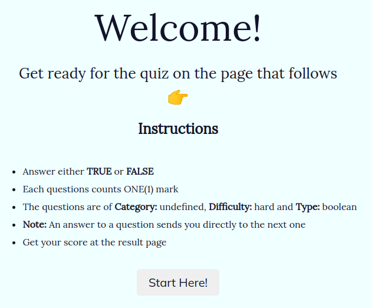
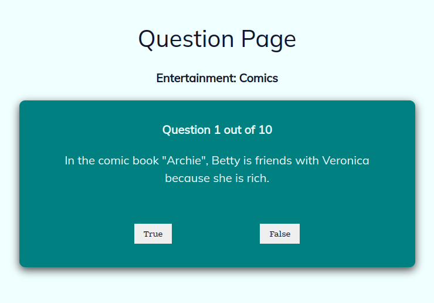
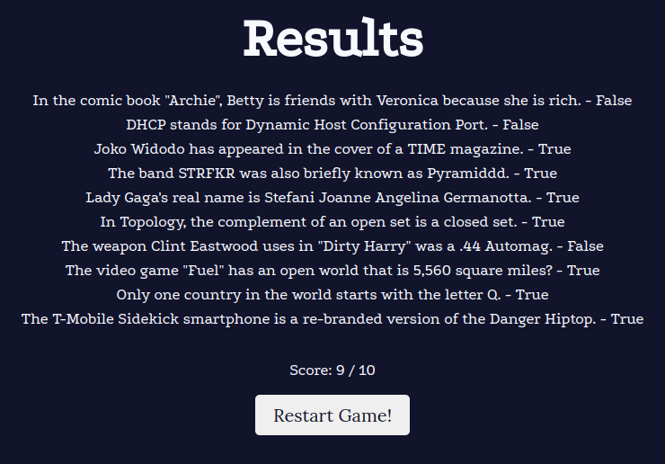

# react-quiz-app
This project is all about a Simple Quiz React Application in which a series of questions are given to be answered. The first section shows a landing page that gives an instruction of the game and enables the user to start the game, followed by the question/answer section in which the user is prompt to answer a series of 10 questions on different pages by either true or false and finally a result page that display his final score.
## App

### Built with
- CSS modules
- JavaScript
- React Js
### Prerequisites
- CSS modules
- Google Chrome
- JavaScript
- React Js
### Clone project
Get a local copy of this project by following the steps below:
- $ git clone `git@github.com:Nathanael-Lontsi/react-quiz.git`
- $ `cd reactjs`
- $ `cd react-quiz`
- $ `git checkout react/quiz`
## Start up
Run this on terminal:
- npm install
- npm start
: bust_in_silhouette: **Nathanael-Lontsi**
## :handshake :Contributions
Contributions, feature requests and issues are welcome. Feel free to have a look on the [issues page](https://github.com/Nathanael-Lontsi/react-quiz/issues)
## :memo :License
This project is [rebaseacademy](./LICENSE) licensed.
